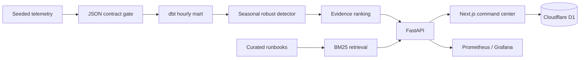

# SignalOps

**Data incident intelligence, measured.** SignalOps is a production-shaped portfolio project that detects service anomalies, ranks diagnostic evidence, retrieves cited runbooks, and preserves a durable analyst record.

It is deliberately built across the boundaries interviewers care about: data engineering, applied statistics, ML evaluation, API design, orchestration, observability, and product-quality frontend work.

## Verified benchmark

The checked-in benchmark is deterministic (`seed=90426`, dataset checksum `fb3536de6f518627`). It covers 60,480 hourly telemetry rows, 12 service-region entities, a 42-day warm-up, and 31 incidents in the untouched evaluation window.

| Event-level metric | Rolling z-score | SignalOps |
|---|---:|---:|
| Precision | 11.9% | **87.9%** |
| Recall | 48.4% | **93.5%** |
| F1 | 19.1% | **90.6%** |
| False-positive episodes | 111 | **4** |
| False alerts / 1k entity-hours | 2.29 | **0.08** |

SignalOps produced a **71.5 percentage-point F1 improvement** and **96.4% fewer false-positive episodes** than the baseline. Its event-level bootstrap intervals are 75.8–97.0% for precision and 83.9–100% for recall. Median detection delay is one hour.

These are synthetic holdout results, not production claims. Labels are stored separately, current observations are excluded from their own expectations, and four benign deployment disturbances are deliberately left unlabelled.

The same evidence pack also reports:

- Runbook retrieval: 80% hit@1, 90% hit@3, 0.85 MRR on 10 paraphrased queries.
- Experiment analysis: +2.23 percentage-point CUPED-adjusted lift, 95% CI 1.66–2.79pp, 44.1% variance reduction across 12,000 units.
- Release gate: detector quality, retrieval quality, and reproducibility all pass.

## Product surface

The web application is an operations command center, not a static landing page. Reviewers can investigate incidents, inspect observed-versus-expected signals, read ranked non-causal evidence, open cited runbooks, save analyst notes, resolve incidents, and persist benchmark runs to Cloudflare D1.

## Architecture



## Run it

Requirements: Node 22.13+, Python 3.11+.

```bash
npm install
python3 -m pip install -e '.[dev]'
npm run backtest
npm test
npm run dev
```

The frontend runs at `http://localhost:3000`. The analytics API can be started separately:

```bash
PYTHONPATH=services/analytics uvicorn signalops.api:app --reload --port 8000
```

Useful endpoints: `/healthz`, `/metrics`, `/v1/incidents`, `/v1/benchmarks/latest`, and `/v1/experiments/analyze`.

## Repository map

- `app/` — reviewer-facing product and durable D1 API route.
- `services/analytics/signalops/` — telemetry, detectors, backtest, diagnostics, retrieval, experiments, and FastAPI.
- `contracts/` — incoming event schema.
- `warehouse/` — dbt staging and mart models with tests.
- `orchestration/` — idempotent hourly Airflow DAG.
- `observability/` — Prometheus and Grafana provisioning.
- `artifacts/` — machine-readable benchmark evidence.
- `docs/` — implementation plan, methodology, architecture, threat model, runbook, and interview evidence.

## Honest limitations

The telemetry and incidents are synthetic; the project validates engineering and evaluation behavior, not a universal detection rate. Diagnostic rankings are observational clues, not causal conclusions. The offline BM25 benchmark is intentionally transparent and small. The included streaming, warehouse, and monitoring services are a local reference topology—not a claim that a portfolio deployment processes live production traffic.

## CV-ready wording

> Built SignalOps, an end-to-end data incident intelligence platform spanning deterministic telemetry generation, leakage-safe seasonal anomaly detection, dbt/Airflow pipelines, FastAPI, grounded runbook retrieval, Cloudflare D1, CI, and an accessible operations UI.

> On a seeded 31-incident synthetic holdout, improved event-level F1 from 19.1% to 90.6% and reduced false-positive episodes by 96.4% versus a rolling z-score baseline; reported bootstrap confidence intervals, ablations, category recall, and detection delay.

See [`docs/resume-evidence.md`](docs/resume-evidence.md) for the exact claim boundaries and reproduction commands.
