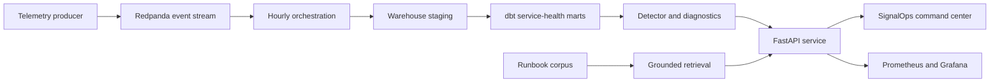

# SignalOps implementation plan

## 1. Portfolio objective

SignalOps will be a production-shaped data incident intelligence platform. It will ingest service telemetry, detect anomalous behavior, rank likely causes, retrieve the most relevant operational guidance, and preserve an auditable incident record. The project is designed to demonstrate the intersection employers repeatedly ask for across AI engineering, applied data science, machine-learning engineering, and data engineering.

The product must be understandable in a five-minute portfolio review, technically credible in a one-hour interview, and reproducible by another engineer from a clean checkout.

## 2. User and problem

Primary user: a data platform or product-analytics engineer responsible for several business-critical services.

Core problem: dashboards expose symptoms, but responders still lose time correlating metric changes, identifying the affected slice, locating the right runbook, and creating a defensible incident record.

Primary workflow:

1. Inspect a prioritized incident queue.
2. Open an incident and review the affected service, region, metrics, and detection evidence.
3. Compare the current signal with the seasonal expectation.
4. Review ranked root-cause candidates.
5. Open cited runbook guidance.
6. Acknowledge the incident and leave an analyst note.
7. Review detector performance and regression gates before release.

## 3. Scope and non-goals

In scope:

- Deterministic synthetic telemetry with daily and weekly seasonality.
- Explicitly planted incidents with machine-readable ground truth.
- Leakage-safe baseline and robust seasonal detectors.
- Event-level backtesting with incident matching and detection-delay measurement.
- Bootstrap confidence intervals and component ablations.
- Segment-level diagnostic ranking.
- A statistically rigorous experiment-analysis example using CUPED.
- Grounded runbook retrieval with citations and retrieval evaluation.
- Data contracts, dbt models, orchestration examples, API services, observability, CI, and operational documentation.
- A durable, deployed reviewer experience.

Non-goals:

- Claiming synthetic results predict production performance.
- Training a foundation model.
- Autonomous remediation.
- Pretending that a deterministic hosted demonstration is a live enterprise stream.

## 4. System architecture

The repository will contain five independently reviewable layers:

1. **Telemetry and labels** — seeded generator, event contracts, incident catalogue.
2. **Analytics** — detectors, matching, root-cause ranking, experiments, retrieval evaluation.
3. **Data platform** — staging and mart models, tests, orchestration DAG, backfill semantics.
4. **Serving and operations** — FastAPI, health and metrics endpoints, containers, monitoring configuration.
5. **Reviewer product** — deployed incident command center with persisted acknowledgements and notes.

The local reference topology is:

## 5. Data design

Telemetry grain: one row per hour, service, and region.

Dimensions:

- timestamp
- service
- region
- deployment version

Measures:

- request count
- error rate
- p95 latency
- revenue

Ground truth is stored separately from features. Each incident declares its start, end, service, region, category, and affected measures. This separation prevents labels from leaking into detection logic.

Generation requirements:

- Fixed seed and stable output checksum.
- Daily demand seasonality.
- Weekend effect.
- Service- and region-specific baselines.
- Slowly changing traffic trend.
- Correlated but non-identical measures.
- Missing values and a controlled late-arrival sample.
- Incidents introduced only after a warm-up period.

## 6. Detection design

Baseline:

- Trailing rolling mean and standard deviation.
- Current row excluded from its own expectation.
- Direction-aware z-score.
- Alerts collapsed into episodes before scoring.

SignalOps detector:

- Same-hour-of-week seasonal reference window.
- Robust median and median absolute deviation.
- Metric-specific scale floors.
- Direction-aware scoring.
- Persistence requirement to suppress one-off spikes.
- Cross-metric corroboration for severe single-period signals.
- Explicit cold-start behavior.

No detector parameter may be chosen by inspecting the test labels. Constants are documented and fixed before the holdout backtest.

## 7. Evaluation contract

Evaluation unit: incident episode, not telemetry row.

An alert is a true positive when it matches the incident service and region and occurs between incident start and one hour after incident end. Only the first matched episode counts toward recall; duplicate episodes are false positives.

Report:

- precision
- recall
- F1
- false alerts per 1,000 monitored entity-hours
- median and mean detection delay
- incident-category recall
- 95% bootstrap confidence intervals
- ablation results

Release gates:

- SignalOps F1 must exceed the baseline.
- Recall must be at least 0.80.
- Precision must be at least 0.75.
- Retrieval hit rate at 3 must be at least 0.90.
- The complete result must be deterministic for the same seed.

## 8. Diagnostic ranking

For the first alert in an incident:

- Compute robust deviations for every metric.
- Compare the affected slice with sibling regions and services.
- Rank candidates by deviation magnitude, temporal alignment, and corroboration.
- Return evidence rather than a causal claim.
- Include an explicit limitation when evidence is observational.

## 9. Experiment analysis

The project includes a synthetic feature experiment so the repository demonstrates decision science as well as monitoring.

- Unit-level pre-period covariate and post-period outcome.
- Reproducible random assignment.
- Known planted treatment effect.
- CUPED adjustment estimated without using treatment labels to alter the covariate.
- Difference in means, standard error, confidence interval, p-value, and variance reduction.
- Plain-language decision output with assumptions.

## 10. Grounded operational retrieval

- Curated runbooks for latency, errors, traffic drops, and revenue anomalies.
- BM25 retrieval implemented transparently for the offline benchmark.
- Returned guidance always includes document identifiers and section citations.
- Evaluation set separates query wording from runbook titles.
- Metrics: hit rate at 1, hit rate at 3, and mean reciprocal rank.
- Provider interface documented for swapping in embeddings or an LLM without weakening the deterministic benchmark.

## 11. Data engineering layer

- JSON Schema contract for incoming events.
- Bronze/staging model with type normalization and deduplication.
- Hourly service-health fact model with declared grain.
- Incident-feature mart with lagged features only.
- dbt uniqueness, not-null, accepted-value, relationship, and custom freshness tests.
- Airflow DAG with ingestion, quality gate, dbt build, detection, evaluation, and publish tasks.
- Idempotent partition key and documented backfill behavior.

## 12. API and operations

FastAPI endpoints:

- `GET /healthz`
- `GET /metrics`
- `GET /v1/incidents`
- `GET /v1/incidents/{incident_id}`
- `GET /v1/benchmarks/latest`
- `POST /v1/experiments/analyze`

Operational requirements:

- Strict request validation.
- Structured error responses.
- Request IDs.
- Prometheus counters and latency histogram.
- Readiness checks.
- Container health check.
- Unit and contract tests.
- No secrets in source or images.

## 13. Hosted reviewer experience

The deployed application will show:

- Current service health and detector release gate.
- Incident queue with severity, service, region, and status filters.
- Seasonal expected-versus-observed chart.
- Ranked diagnostic evidence.
- Cited runbook guidance.
- Benchmark comparison and confidence intervals.
- Retrieval evaluation metrics.
- Pipeline execution state.
- Persisted incident acknowledgement and analyst notes tied to the authenticated user.

The site will remain useful if persistence is temporarily unavailable by falling back to read-only benchmark data while clearly labelling the mode.

## 14. Visual direction

- Dense but calm operations interface.
- Off-white workspace, charcoal navigation, electric blue data accent, amber incident accent.
- Small radii, one-pixel borders, tabular numbers, minimal shadows.
- No neon, glassmorphism, gradients, oversized marketing copy, or generic AI imagery.
- Charts prioritize comparisons and uncertainty over decoration.
- Keyboard-visible focus, semantic tables, and reduced-motion support.

## 15. Validation and evidence package

Automated validation:

- Generator determinism.
- Contract validation.
- Detector leakage checks.
- Episode matching edge cases.
- Backtest regression gates.
- Retrieval evaluation.
- Experiment estimator recovery.
- API responses.
- Web build, lint, interaction, and accessibility checks.

Interview artifacts:

- Architecture document.
- Data dictionary and contracts.
- Backtest methodology.
- Machine-readable benchmark JSON.
- Model card.
- Threat model.
- Runbook.
- One-page case study.
- Resume bullets that state the synthetic nature and exact benchmark scope.

## 16. Delivery sequence

1. Freeze the contract and generator seed.
2. Generate the labelled dataset.
3. Implement baseline and robust detectors.
4. Implement event matching and tune only against calibration data.
5. Freeze thresholds.
6. Run the holdout backtest and bootstrap intervals.
7. Add diagnostics, experiment analysis, and retrieval evaluation.
8. Export benchmark artifacts.
9. Build warehouse and orchestration examples.
10. Build and test the API.
11. Build durable reviewer APIs.
12. Build the web command center.
13. Add operations, security, and interview documentation.
14. Run full validation from a clean command.
15. Publish privately first; make public only on explicit approval.
